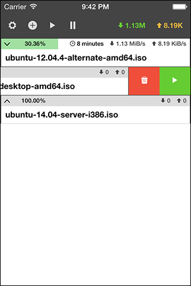
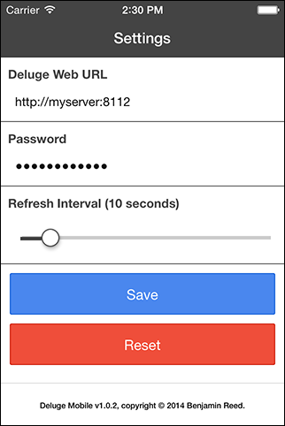
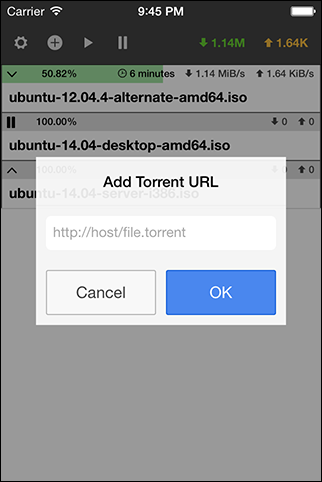
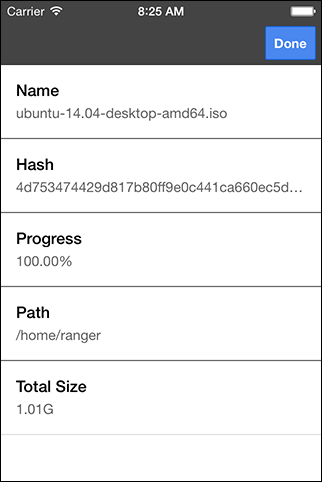

Deluge Mobile
=============

This is a simple mobile client for the Deluge torrent server.  It uses the same
ReST/JSON API that the Deluge web UI uses.  It is licensed under the same terms
as Deluge itself. (GPLv3)

Deluge Mobile is written using:

* [AngularJS](https://angularjs.org/)
* [Ionic Framework](http://ionicframework.com/)
* [angular-cache](https://github.com/jmdobry/angular-cache)
* [angularLocalStorage](https://github.com/agrublev/angularLocalStorage)
* [Moment.js](http://momentjs.com/)

It has been tested with Deluge 1.3.

Deluge Mobile is Copyright (c) 2014 Benjamin Reed.

App Store
=========

Deluge Mobile is available in the following app stores:

* [Google Play (Android Devices)](https://play.google.com/store/apps/details?id=com.raccoonfink.deluge_mobile)
* Amazon (coming soon!)
* Apple (coming soon!)

Screenshots
===========

     

Acknowledgements
================

The Deluge Mobile logo is a modified version of the ion-waterdrop icon from [Ionicons](http://ionicons.com/), originally licensed as the following:

Copyright (c) 2013 Drifty (http://drifty.com/)

Permission is hereby granted, free of charge, to any person obtaining a copy
of this software and associated documentation files (the "Software"), to deal
in the Software without restriction, including without limitation the rights
to use, copy, modify, merge, publish, distribute, sublicense, and/or sell
copies of the Software, and to permit persons to whom the Software is
furnished to do so, subject to the following conditions:

The above copyright notice and this permission notice shall be included in
all copies or substantial portions of the Software.

THE SOFTWARE IS PROVIDED "AS IS", WITHOUT WARRANTY OF ANY KIND, EXPRESS OR
IMPLIED, INCLUDING BUT NOT LIMITED TO THE WARRANTIES OF MERCHANTABILITY,
FITNESS FOR A PARTICULAR PURPOSE AND NONINFRINGEMENT. IN NO EVENT SHALL THE
AUTHORS OR COPYRIGHT HOLDERS BE LIABLE FOR ANY CLAIM, DAMAGES OR OTHER
LIABILITY, WHETHER IN AN ACTION OF CONTRACT, TORT OR OTHERWISE, ARISING FROM,
OUT OF OR IN CONNECTION WITH THE SOFTWARE OR THE USE OR OTHER DEALINGS IN
THE SOFTWARE.
